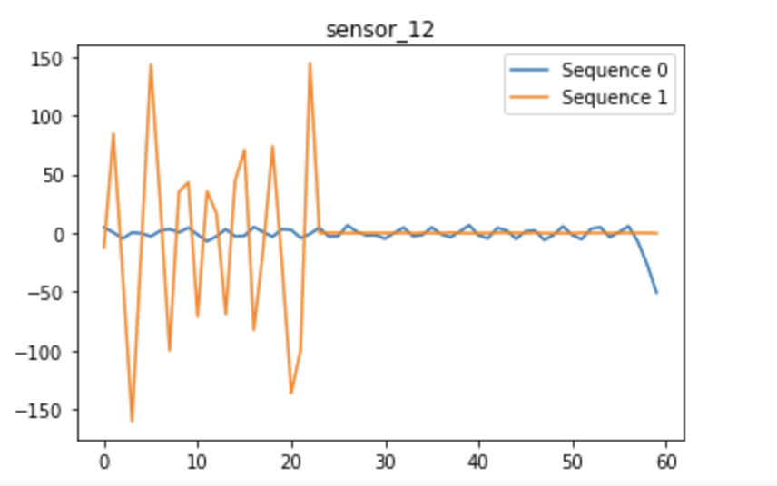
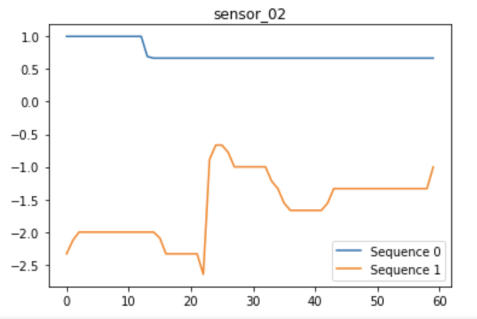
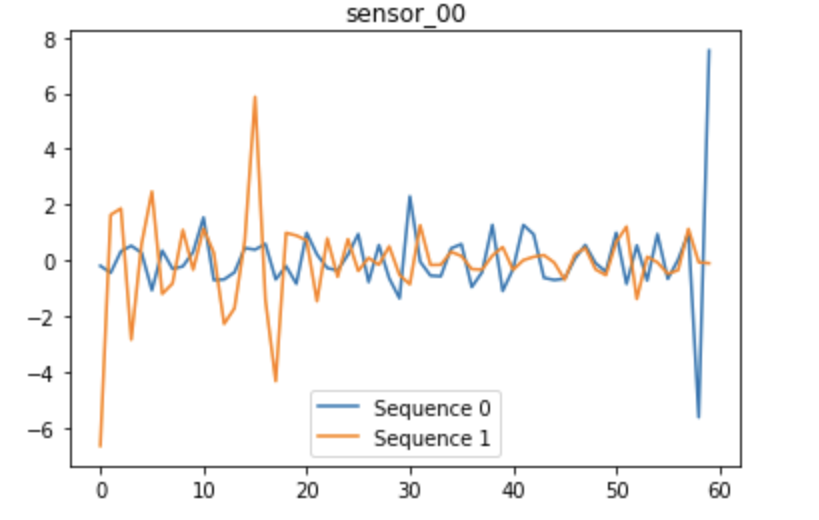
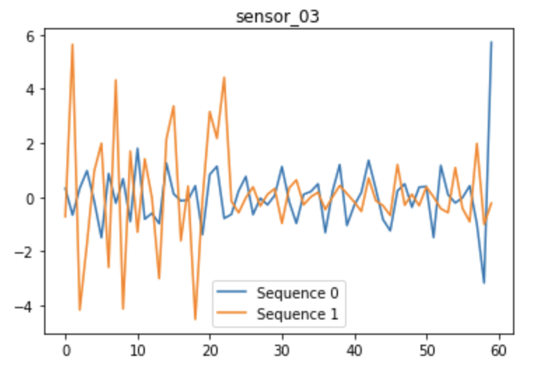

# Tabular Playground Series - Apr 2022

* **One Sentence Summary** :This repository holds an attempt to apply LSTMs to arbitrary action time series data from
Tabular Playground Series - Apr 2022 challenge on Kaggle. (https://www.kaggle.com/competitions/tabular-playground-series-apr-2022)

## Overview

  * **Definition of the tasks / challenge**:  The task, as defined by the Kaggle challenge is to use a time series of 12 features, in time steps of 1 sec. for a overall total sequence of 1 minute to predict the action that best fits that sequence. The classification problem is rather arbitrary in discussing the actual actions thus we name them state 0 and state 1. The goal is to provide the best possible area under the curve for the ROC curve.
  * **Your approach**:The approach in this repository formulates the problem as classification task, using LSTM as the model under RNN with the full time series of features as input. The goal is to use LSTM to allow us to create an accurate model that would help in classifying states of the personnel.
  * **Summary of the performance achieved**: My best model was able to guarantee a Area under the curve of the ROC curve to about .46.  At the time of writing, the best performance on Kaggle of this metric is .48 for AUC on ROC.

## Summary of Workdone

### Data

* Data:
  * Type: 
    * Input: CSV file of 12 features, output: 0 or 1 for the sequence state.
  * The training set: Comprising ~26,000 60-second recordings of thirteen biological sensors for almost one thousand experimental participants.
  * The test set: For each of the ~12,000 sequences, you should predict a value for that sequence's state
 
#### Preprocessing / Clean up

* The only preprocessing needed was to format the data that would allow it to be processed by the LSTM layer. THe data has a row for each time step and each time step has 12 features thus with the 60 time steps per sequence. We end up with a sample of 720 variables. More specifically the data structure had to be constructed as a 3 dimensional tensor. The tensor had shape (samples,time step,features).

#### Data Visualization

Using the Labeled training data set we can find a representation of 2 states, namely sequence 0 and sequence 1. 

These are two representation of features that may possibly be used to distinguish the states.

These are two representation of features that may not be as useful when distinguishing the states.

This small data visualization can give us a better grasp of the data that we are presented with and give us insight on possible ways of changing our model.

### Problem Formulation

* Define:
  * Input / Output: 
  * Models
    * The only model that I tried this round was the LSTM model under the RNN. The reason I used this model is because LSTM is good at being able to lear and remember over long sequences of input data. The model learns to extract features from sequences of observations and how to map the internal features to different action types. Also with the added benefit of not needing to engineer extra features.
  * Loss:binary_crossentropy
  * optimizer=adam(Gradient Descent)

### Training
  * The model was trained on spyder 5.0 using keras and tensorflow packages.
  * The training took about half a minute due to the size of the training set that was actually used.
  * Training curves that were used were loss vs epoch and auc vs epoch.
  * The decision of when to stop training was when the model began to overfit the data.
  * The major difficulty/problems were the low amount of data used to train. This made the model less accurate in predicting classifications and also gave it a much more "memorized" approach to the training set.

### Performance Comparison

* The performance metric that we are going to be using is the Area under the ROC curve.

This illustrates the loss over epoch curve as well as the AUC over epoch curve.

### Conclusions

* I can conlude that LSTM is a good way of handling time series classification data. As well as training sets are the core of the model thus having larger amounts of data implicates a better model up to a certain extent.

### Future Work

* The next next thing that I would love to try is using a CNN to handle classification of time series data. Also just use a very much larger set of training data to train my LSTM model.
* Another thing for the future is possibly using other models that can classify time series data and comparing the effeciency in terms of time and results.

## How to reproduce results

* Get the data from Kaggle. From here you want to be able to use the data in the LSTM model thus we need a tensor of shape (samples, time steps,features). In this case using the Kaggle data you should obtain a tensor of shape (sequences,60,16). From here you want to build a sequential model using keras such that LSTM is the first layer, followed by a desnse relu layer and finally a dense sigimoid layer for classification. Train the model for ten epochs and recored your results over epochs ion a plot.

### Overview of files in repository

* Kaggle Competition Initial Visualization and Preprocessing.ipynb: This journal was used to really get a feel for the data by using small visuals as well as preprocessing the data to fit the LSTM model.
* Kaggle Competition Model Train and Test: This was used to train the model used in the project as well as test it on sever epochs of data.

### Software Setup
* The only software required to perform a similar task would be to install matplotlib, numpy, keras, and tensorflow onto python.
* All these packages and documentation can be found on their own websites.
* These packages can be downloaded through the terminal with pip3 install "package"

### Data

* The data used in this project can be found on the Kaggle competition site. (https://www.kaggle.com/competitions/tabular-playground-series-apr-2022/data)

### Training

*The model was trained using LSTM and dense relu layer and finally classifying using a dense sigmoid layer.

